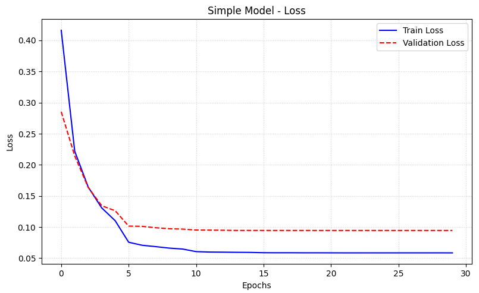
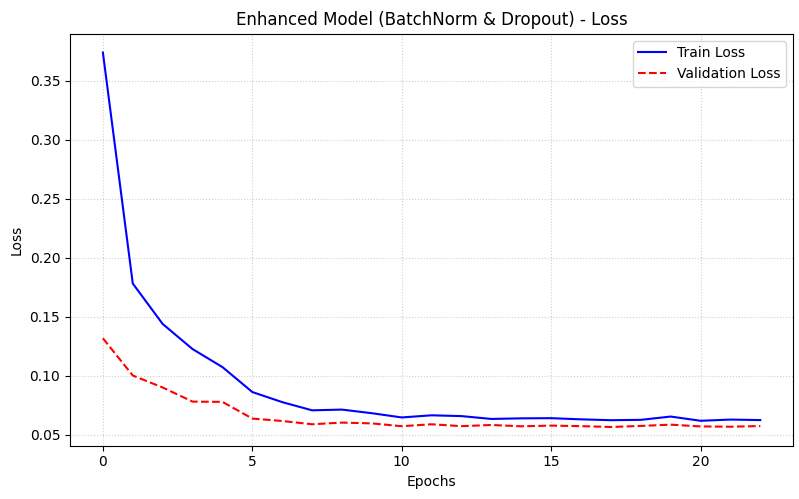
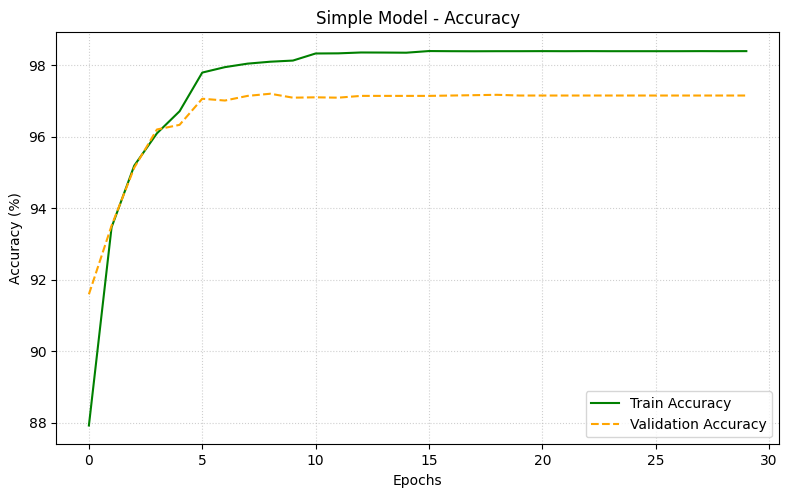
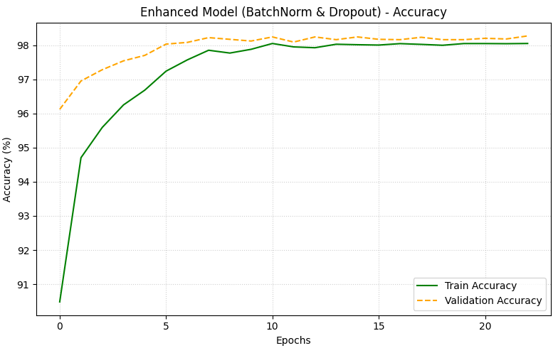

# 🧠 Neural Network Project - Handwritten Digit Recognition (MNIST)

## 📌 Problem Description

This project focuses on solving the **Handwritten Digit Recognition** problem using a **Multilayer Perceptron (MLP)** model.

The goal is to classify grayscale images of handwritten digits (0–9) from the MNIST dataset into their correct labels.

---

## 📂 Dataset

- **Dataset Name:** MNIST

- **Description:**
  The dataset contains 70,000 grayscale images of handwritten digits:
  - 60,000 training images
  - 10,000 testing images

- Each image is 28x28 pixels.

- **Source:**
  https://yann.lecun.com/exdb/mnist/

---

## ⚙️ Data Preprocessing

The following preprocessing steps were applied:

- Conversion to tensor format using PyTorch
- Normalization of pixel values
- Splitting into:
  - Training set
  - Validation set
  - Testing set

---

## 🧠 Model Architecture

### 🔹 Model 1: Simple MLP

- Input Layer: 784 neurons (28×28)
- Hidden Layer: 128 neurons
- Output Layer: 10 neurons
- Activation: ReLU

---

### 🔹 Model 2: Enhanced MLP

- Input Layer: 784 neurons
- Hidden Layers:
  - 256 neurons + BatchNorm + ReLU + Dropout
  - 128 neurons + BatchNorm + ReLU + Dropout

- Output Layer: 10 neurons
- Activation: ReLU

---

## 🏋️ Training Details

- Loss Function: CrossEntropyLoss
- Optimizer: Adam
- Metrics:
  - Training Loss
  - Validation Loss
  - Accuracy

---

## 📊 Results

Test Accuracy
| Model | Accuracy | Loss |
|:-------------------------------------|:---------|-------:|
| Simple Model | 97.42% | 0.0839 |
| Enhanced Model (BatchNorm & Dropout) | 98.27% | 0.0534 |
---
**Best Model:** Enhanced MLP  
**Final Test Accuracy:** 98.38%

---

## 📈 Visualizations

The following plots are included:

- Training vs Validation Loss
   <p align="center">
    
    
  </p>
  
- Accuracy Curves
  <p align="center">
      
      
  </p>


  

---

## 🧪 Experiments

Two experiments were conducted:

1. **Baseline Model (Simple MLP)**
2. **Enhanced Model**
   - Added Batch Normalization
   - Added Dropout
   - Increased number of neurons

### 🔍 Conclusion:

The enhanced model showed improved performance due to better regularization and deeper architecture.

---

## 🚀 How to Run the Project

1. Clone the repository:

```bash
git clone <your-repo-link>
```

2. Navigate to the project folder:

```bash
cd <project-folder>
```

3. Install dependencies:

```bash
pip install torch torchvision matplotlib pandas
```

4. Run the notebook:

```bash
jupyter notebook
```

---

## 📁 Project Structure

```
├── PRO_ANN.ipynb
├── Results/
└──  README.md
```

---

## 🏁 Final Notes

- This project satisfies all course requirements:
  - MLP implementation ✔
  - Training & Evaluation ✔
  - Experimentation ✔
  - Visualization ✔

---
